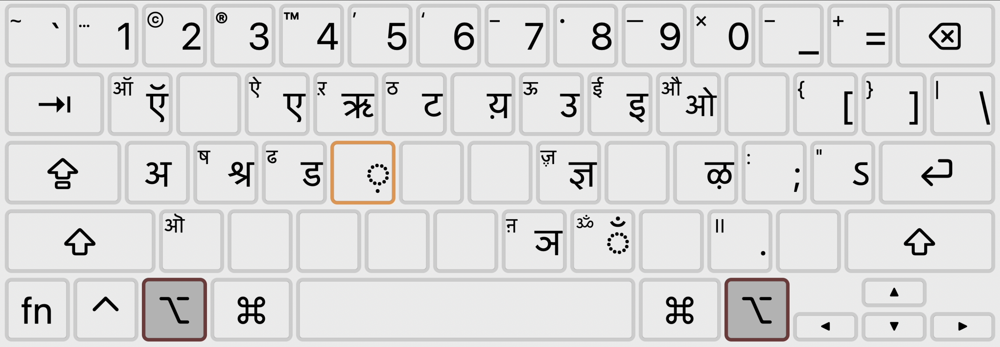

# devanagari-qwerty

This is a port of the Devanagari QWERTY keyboard layout from macOS to Windows. If you have a regular QWERTY keyboard, this layout is much more convenient for typing Devanagari than the standard INSCRIPT layout. It maps letters from the Latin alphabet to their phonetic equivalents in Devanagari, which saves you the trouble of memorizing the INSCRIPT keyboard layout or purchasing a new keyboard.

I use this layout for typing Hindi, but it should work equally well for Sanskrit, Marathi, Nepali, and other Devanagari-based languages. If you find that it's missing any letters, you might want to customize it. See the section on customizing the layout below.

## What Does it Look Like?

When no modifier keys are pressed:

With `Shift` pressed:

With `AltGr` (`Opt` on macOS) pressed:

With `Shift + AltGr` (`Shift + Opt` on macOS) pressed:

## Installing

[Download and run the installer from the releases page](https://github.com/s3thi/devanagari-qwerty/releases/). You should then be able to see the layout in the list of input methods in the Windows settings. The input method will also appear in your language bar.

## Customizing the Layout

Clone this repository and open `DvQWERTY.klc` using [Microsoft Keyboard Layout Creator](https://www.microsoft.com/en-us/download/details.aspx?id=102134). When you are satisfied with your customizations, use the "Build DLL and Setup Package" option in the app to create a new installer that includes your changes.
